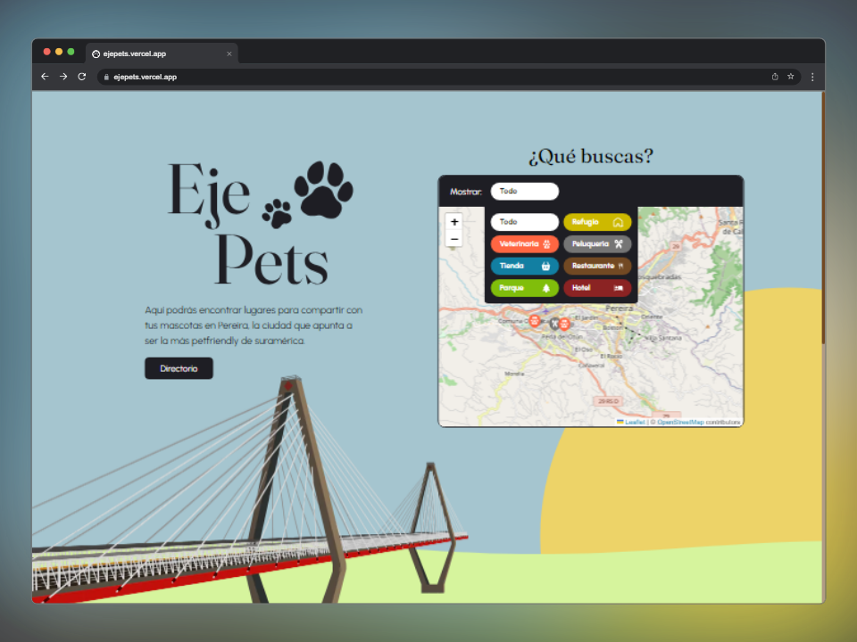

import CustomImage from '@components/CustomImage.astro';
import Description from '@components/projectPage/Description.astro';
import Typography from '@components/Typography.astro';
import Button from '@components/Button.astro';
import Row from '@components/projectPage/Row.astro';
import List from '@components/projectPage/List.astro';
import TechCard from '@components/projectPage/TechCard.astro';
import Gallery from '@components/projectPage/Gallery.astro';

export const components = {
  h1: (props) => <Typography as="h2" {...props} class="lora" />,
  h2: (props) => <Typography as="h3" {...props} />,
  h3: (props) => <Typography as="h4" {...props} />,
  p: (props) => <Typography as="p" {...props} />,
  ul: List,
}

export const {
  title,
  excerpt,
  mockup,
  mockupAlt,
  demoLink,
} = frontmatter

export const wasForAClient = false;
export const stack = ["Next.js", "React", "Tailwind CSS", "Firebase", "Leaflet"]

<Description>
  <CustomImage
    mobileImgUrl={mockup}
    desktopImgUrl={mockup}
    slot="image"
    class="project__image"
  />
  <Fragment slot="content">
    

      <Typography as="p" class="semibold" style="font-size: 1.125rem">
        { wasForAClient ? "Cliente" : "Personal" }
      </Typography>
      This project was led by love for our pets, with the goal is to provide an easy way to reach those business that offer services for our best friends, all in one place.
      <Button
        as="a"
        href={demoLink}
        style="margin-top: 8px; display: block; width: fit-content;"
      >
        Demo
      </Button>
    

    

      <Typography as="p" class="semibold" style="font-size: 1.125rem">
        {"Tecnologías"}
      </Typography>
      <List>
        {stack.map(tech => (
          <li>{tech}</li>
        ))}
      </List>
    

  </Fragment>
</Description>

<Row paddedRight>
  # What makes this unique

  Fugiat ea proident adipisicing dolore nisi magna. Ea aliqua nisi proident id quis eiusmod. Do sit ex nostrud eu esse. Mollit in ad excepteur aliqua et nostrud ea consequat laborum voluptate. Ullamco est fugiat duis reprehenderit mollit exercitation laborum minim. Consectetur voluptate irure voluptate ullamco eiusmod quis et. Eu sunt sunt consectetur nisi eu deserunt fugiat consequat.

  Anim Lorem incididunt ea cillum mollit quis nisi et aliqua commodo aute. Ex magna irure magna nisi. Elit pariatur ipsum do incididunt culpa. Eu anim aliquip anim laboris ea pariatur ut qui velit aliqua.
</Row>

<Row evenColumns inverted>
  

    # Why these technologies

    Fugiat ea proident adipisicing dolore nisi magna. Ea aliqua nisi proident id quis eiusmod. Do sit ex nostrud eu esse. Mollit in ad excepteur aliqua et nostrud ea consequat laborum voluptate. Ullamco est fugiat duis reprehenderit mollit exercitation laborum minim. Consectetur voluptate irure voluptate ullamco eiusmod quis et. Eu sunt sunt consectetur nisi eu deserunt fugiat consequat.

    Anim Lorem incididunt ea cillum mollit quis nisi et aliqua commodo aute. Ex magna irure magna nisi. Elit pariatur ipsum do incididunt culpa. Eu anim aliquip anim laboris ea pariatur ut qui velit aliqua.
  

  

    {
      stack.map(tech => (
        <TechCard tech={tech} />
      ))
    }
  

</Row>

<Row centered>
  # Things that made it worth it

  Fugiat ea proident adipisicing dolore nisi magna. Ea aliqua nisi proident id quis eiusmod. Do sit ex nostrud eu esse. Mollit in ad excepteur aliqua et nostrud ea consequat laborum voluptate. Ullamco est fugiat duis reprehenderit mollit exercitation laborum minim. Consectetur voluptate irure voluptate ullamco eiusmod quis et. Eu sunt sunt consectetur nisi eu deserunt fugiat consequat.

  Anim Lorem incididunt ea cillum mollit quis nisi et aliqua commodo aute. Ex magna irure magna nisi. Elit pariatur ipsum do incididunt culpa. Eu anim aliquip anim laboris ea pariatur ut qui velit aliqua.
</Row>

<Row> 
  # Gallery

  <Gallery>
    

    

    
  </Gallery>
</Row>
